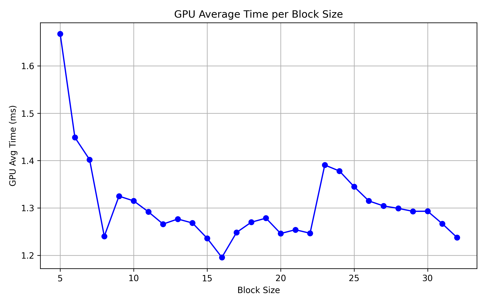

# CLE Third Assigment
## Implementation
### Convolution
The **convolution_kernel** performs 2D convolution in an image that is passed to the function as a one dimensional array. The function starts by calculating the image coordinates for the thread (x,y) in each thread and checks if the pixel is inside the boundaries, meaning it excludes borders based on kernel size. Then it iterates over the kernel that is centered in the pixel (x,y) and multiplies each value to the kernel weight at that window position and adds the result to an accumulator. Finally it stores the value in the output image array.
### Non Maximum Suppression
The **non_maximum_suppression_kernel** performs non-maximum suppression on an edge magnitude map. Like in the other function, each thread starts by calculating the pixel (x,y) that they will work on, skipping border pixels to avoid out-of-bounds access. Then it calculates the gradient direction using the arctangent of the X and Y gradient components and normalizes to one of the four directions 0º,45º,90º and 135º. After that it compares the pixel gradient to the neighbors in the direction. If the pixel has a higher magnitude compared to the neighbors then the nms of the pixel is kept has the magnitude else its set to zero, Preserving only the local maxima.
### First edges
The **first_edges_kernel** performs the first thresholding in the algorithm. Starts by getting the (x,y) values of the pixel and checking if the pixel is not on the border. It checks if non-maximum suppressed value at that pixel is greater than or equal to the threshold given **tmax**. If so the value in the edges array is set to **MAX_BRIGHTNESS**; otherwise, it is set to 0. 
### Hysteresis Edges
The **hysteresis_edges_kernel** is used in the hysteresis stage of Canny edge detection to connect weak edges to strong ones. It processes each pixel similarly to the other functions. Then, it checks if the value in the NMS array is greater than or equal to threshold **tmin** and if the pixel is not already marked as an edge, the kernel will check the 8 neighboring pixels in the edges array. If any neighbor is a strong edge (**MAX_BRIGHTNESS**) the pixel is promoted to a strong edge and the **d_changed** flag is set to true to indicate that a change occurred, triggering another iteration.
### Gaussian Filter
The **gaussian_filter_device** performs a Gaussian filter and then normalizes the image. First it creates the kernel on the host and transfers it to the GPU memory, then it applys a convolution to the image using the created kernel. After this we allocate a space in memory to store the max and min pixel values of the image. We use the Min Max kernel for obtaining the values and then we pass them to the Normalize kernel which, in this case, will places all the values in the image between 0 and 255.
### Min Max
The **min_max_kernel** computes the minimum and maximum pixel values in an image. Each thread processes one pixel at coordinates (x, y) then calculates the linear index of the pixel. It reads the pixel value from the input array **in** and uses the atomic operations **atomicMin** and **atomicMax**. The functions are used because they prevent race conditions when accessing global memory, ensuring that only one thread at a time can update the value.
### Normalize
The **normalize_kernel** is a kernel that normalizes pixel values to a range of 0 to **MAX_BRIGHTNESS**. Each thread determines the pixel coordinates (x, y) within valid bounds, excluding borders. The function accesses **d_max** and **d_min**, which point to values in device memory, using them it computes the normalized intensity for the current pixel using linear normalization, and scales it to the output range. The normalized result is written to the **d_inout** array.

### Canny Device
The **cannyDevice** function implements the full Canny edge detection pipeline on the GPU using CUDA. It starts by allocating memory on the device for the input image **d_idata**, the output data **d_odata**, 	gradient components **d_gradient_x**,**d_gradient_y**, and the non-maximum results **d_nms**. Then we copy the input image data to the device. The first processing step is applying a Gaussian filter. It then sets up the Sobel kernels for edge detection and copies them to device memory. 	Using the convolution function, we compute the horizontal and vertical gradient which are then merged using the mergeGradientsKernel using the merge gradients kernel. Next non-maximum suppression is applied to thin the edges and applies a high threshold to identify strong edges. The function then enters a do-while loop that performs **hysteresis_edges_kernel**, where we connect weak edges to strong edges promoting them from weak to strong the loop uses the variable **h_changed** to know if any pixels where changed during the function so we copy the value from the device to the host to check until no pixels changed. At last we copy the outpute image to the host and free all the allocated memory in the device.

## Results

Average time on host is `~33.735651 ms`

The best time is `1.195702 ms` obtained with a block size of `16` and resulting in a `28.203x` speedup compared to the host.  

| Block Size | GPU Avg Time (ms) | Speedup vs CPU (×) |
| ---------- | ----------------- | ------------------ |
| 1          | 11.183820         | 3.016×             |
| 2          | 3.721225          | 9.063×             |
| 3          | 2.388809          | 14.121×            |
| 4          | 1.916067          | 17.606×            |
| 5          | 1.667478          | 20.227×            |
| 6          | 1.448928          | 23.285×            |
| 7          | 1.402076          | 24.059×            |
| 8          | 1.240262          | 27.195×            |
| 9          | 1.324963          | 25.464×            |
| 10         | 1.314988          | 25.654×            |
| 11         | 1.291891          | 26.116×            |
| 12         | 1.266064          | 26.638×            |
| 13         | 1.276710          | 26.415×            |
| 14         | 1.268291          | 26.589×            |
| 15         | 1.236038          | 27.292×            |
| **16**         | **1.195702**          | **28.203×**            |
| 17         | 1.248368          | 27.021×            |
| 18         | 1.269945          | 26.547×            |
| 19         | 1.278505          | 26.373×            |
| 20         | 1.246118          | 27.064×            |
| 21         | 1.254086          | 26.899×            |
| 22         | 1.246681          | 27.050×            |
| 23         | 1.390720          | 24.258×            |
| 24         | 1.377961          | 24.487×            |
| 25         | 1.344880          | 25.075×            |
| 26         | 1.314870          | 25.656×            |
| 27         | 1.304316          | 25.859×            |
| 28         | 1.299126          | 25.964×            |
| 29         | 1.292972          | 26.083×            |
| 30         | 1.293110          | 26.080×            |
| 31         | 1.266649          | 26.624×            |
| 32         | 1.237705          | 27.251×            |

